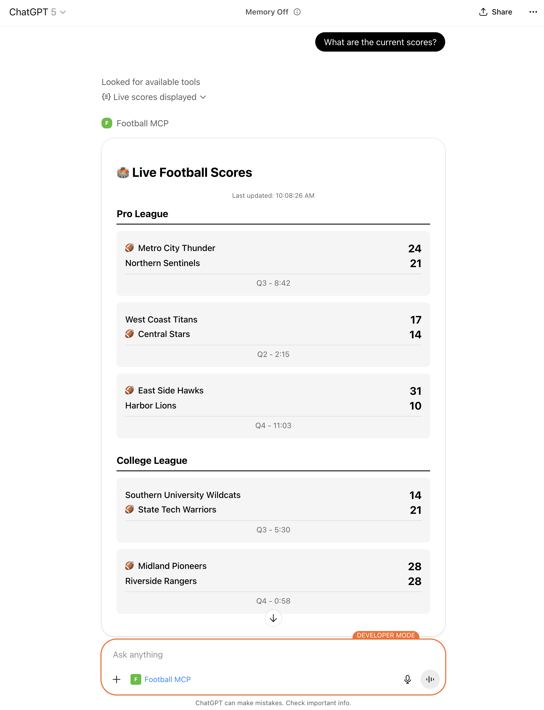
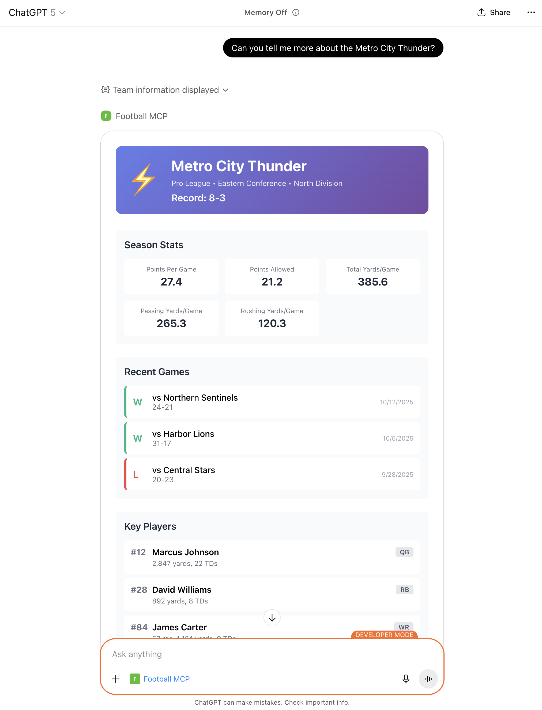

# Football MCP Server

An example Rails 8 application that demonstrates how to build a [Model Context Protocol](https://modelcontextprotocol.io/) server with interactive UI components using the [official Ruby MCP SDK](https://github.com/modelcontextprotocol/ruby-sdk) and the OpenAI Apps SDK.

**✨ OpenAI Apps SDK Example** - This application highlights how to use the OpenAI Apps SDK to build out UI components for your Rails MCP server, including React widgets that render inside ChatGPT using Streamable HTTP transport and Server-Sent Events (SSE).

## Features

- **Streamable HTTP transport** - The recommended transport for ChatGPT integration
- **Server-Sent Events (SSE)** - Real-time streaming of tool responses
- **Session management** - Proper handling of multiple concurrent clients
- **React 19 widgets** - Interactive UIs that render inside ChatGPT
- **Component registry pattern** - Reusable widget architecture for rapid development
- **Upcoming schedule widget** - Interactive ticket-purchase CTA powered by the OpenAI Apps SDK
- **In-widget follow-ups** - Live scores widget can trigger follow-up prompts (via `sendFollowUpMessage`) to fetch deeper data without typing

## ⚠️ Production Warning

**This application is NOT production-ready.** It uses in-memory session storage which:
- Does not work with multiple servers or processes
- Loses all sessions on restart
- Is suitable only for development, demos, and single-server deployments

For production use, implement Redis-backed sessions or use stateless mode.

## Screenshots

### Live Scores Widget



The Live Scores Widget displays real-time football game scores in an interactive React component rendered inside ChatGPT.

### Team Info Resource



The Team Info resource provides structured NFL team data including divisions, colors, and stadium information.

## Setup

```bash
bundle install
npm install
cp .env.example .env
# Edit .env and set BASE_URL to your tunnel URL for ChatGPT testing
```

**Start the server:**

```bash
# Recommended: Start everything with one command (Rails + JS build + Cloudflare Tunnel)
# Note: Requires cloudflared to be installed and configured
bin/dev

# Alternative: For local testing only (no HTTPS tunnel, no auto-rebuild)
bin/rails server
```

**Build React widgets manually:**

```bash
# One-time build
npm run build

# Watch mode (rebuilds on changes) - not needed if using bin/dev
npm run watch
```

**Run tests:**

```bash
bin/rails test
```

**Run linter:**

```bash
rubocop
```

## ChatGPT / OpenAI Apps SDK Integration

### HTTPS Tunneling for Development

ChatGPT requires an HTTPS endpoint to connect to your local development server. You have several options:

**Option 1: Cloudflare Tunnel (Recommended)**
- No browser warnings or interstitials
- Works with your own domain
- Free tier available
- Install `cloudflared` and configure in `Procfile.dev`:
  ```
  tunnel: cloudflared tunnel run your-tunnel-name
  ```
- More stable for long development sessions

**Option 2: ngrok (Paid Plan)**
- Free tier shows browser warnings that **break ChatGPT integration**
- Paid plans ($8+/month) remove the browser warning
- Simple setup: `ngrok http 3000`
- Good for quick testing with paid account

**Option 3: Other Tunneling Services**
- **localhost.run** - SSH-based tunneling, no installation required
- **Tailscale Funnel** - If you use Tailscale for networking
- **Bore** - Rust-based open source alternative
- **VS Code Port Forwarding** - If using GitHub Codespaces or VS Code Remote

**Important:** Free ngrok accounts show an interstitial "Visit Site" warning page that prevents ChatGPT from loading your resources. You'll need either a paid ngrok account or an alternative tunneling solution.

### Setting up for ChatGPT

1. **Configure your Cloudflare Tunnel** in `Procfile.dev`:
   ```
   tunnel: cloudflared tunnel run your-tunnel-name
   ```

2. **Start with `bin/dev`** - this will run Rails, JS watch, and your tunnel

3. **Find your tunnel URL** from the Cloudflare dashboard and update `.env`:
   ```
   BASE_URL=https://your-tunnel-url.com
   ```

4. **Restart `bin/dev`** for the BASE_URL change to take effect

## Adding Tools

Tools provide callable functions that clients can invoke.

### Step 1: Create a new tool class in `app/mcp_tools/`

```ruby
class MyTool < MCP::Tool
  title "My Tool"
  description "What this tool does"

  input_schema(
    type: "object",
    properties: { param: { type: "string" } },
    required: ["param"]
  )

  def self.call(param:, server_context: nil)
    MCP::Tool::Response.new([{ "type" => "text", "text" => "Result: #{param}" }])
  end
end
```

### Step 2: Register the tool in `app/controllers/mcp_controller.rb`

Add it to the `tools:` array in the `create_transport` method:

```ruby
tools: [GetLiveScoresTool, MyTool]
```

### Current Tools

- **GetLiveScoresTool** (`app/mcp_tools/get_live_scores_tool.rb`): Returns mock live football scores with optional league filtering. Demonstrates response formatting and data filtering patterns.
- **GetTeamInfoTool** (`app/mcp_tools/get_team_info_tool.rb`): Returns information about NFL teams including division, colors, and stadium details. Demonstrates structured data responses.

## Adding Resources

Resources provide data that can be accessed by clients. They can be plain text, JSON, HTML widgets, or any other content type.

### Step 1: Create a new resource class in `app/mcp_resources/`

```ruby
class MyResource
  VERSION = "v1"  # Increment to v2, v3, etc. when content changes
  URI = "my-resource://data?#{VERSION}"

  class << self
    def to_resource
      MCP::Resource.new(
        uri: URI,
        name: "My Resource",
        description: "What this resource provides",
        mime_type: "text/plain"
      )
    end

    def read
      "Resource content here"
    end
  end
end
```

### Step 2: Register the resource in `app/controllers/mcp_controller.rb`

Add `MyResource.to_resource` to the `resources:` array in `create_transport`:

```ruby
resources: [LiveScoresWidgetResource.to_resource, MyResource.to_resource]
```

Add a `when MyResource::URI` case in the `resources_read_handler` block:

```ruby
resources_read_handler: lambda { |uri, server_context|
  case uri
  when LiveScoresWidgetResource::URI
    LiveScoresWidgetResource.read
  when MyResource::URI
    MyResource.read
  else
    raise MCP::Error.new(
      code: MCP::JSONRPC::ErrorCodes::INVALID_PARAMS,
      message: "Unknown resource URI: #{uri}"
    )
  end
}
```

### Important: Resource Versioning

ChatGPT and other MCP clients cache resources aggressively. Always include a version parameter in your resource URI (e.g., `?v1`, `?v2`) and increment it whenever you modify the resource content:

```ruby
class MyResource
  VERSION = "v1"  # Increment to v2, v3, etc. when content changes
  URI = "my-resource://data?#{VERSION}"
end
```

Without versioning, clients will continue using stale cached versions indefinitely, even after server restarts.

## Adding New React Widgets

Adding a new widget requires only **6 steps**:
1. Create the React component
2. Add it to the component registry (one line in `application.js`)
3. Create a resource class that uses the shared template
4. Register the resource in the MCP controller
5. Rebuild assets
6. Test

**No separate ERB template needed!** All widgets share `app/views/mcp_widgets/widget.html.erb`.

### Step 1: Create a new React component

Create a component file in `app/javascript/components/`:

```jsx
// app/javascript/components/MyWidget.jsx
import React from 'react';
import { useToolOutput } from '../utils/openai-hooks';

const MyWidget = () => {
  const toolOutput = useToolOutput();

  if (!toolOutput) {
    return <p>Waiting for data...</p>;
  }

  return (
    <div className="font-sans p-5 bg-white dark:bg-gray-950 text-gray-900 dark:text-gray-100 min-h-screen">
      <div className="max-w-2xl mx-auto">
        <h2 className="text-2xl font-bold mb-4">My Widget</h2>
        <pre className="bg-gray-100 dark:bg-gray-800 p-4 rounded-lg overflow-auto">
          {JSON.stringify(toolOutput, null, 2)}
        </pre>
      </div>
    </div>
  );
};

export default MyWidget;
```

### Step 2: Register the component in `app/javascript/application.js`

Simply add your component to the `COMPONENT_REGISTRY`:

```javascript
import MyWidget from './components/MyWidget';

const COMPONENT_REGISTRY = {
  'LiveScoresWidget': LiveScoresWidget,
  'MyWidget': MyWidget,  // Add this line
};
```

### Step 3: Create a resource class in `app/mcp_resources/`

```ruby
# app/mcp_resources/my_widget_resource.rb
class MyWidgetResource
  VERSION = "v1"
  URI = "ui://widget/my-widget.html?#{VERSION}"

  class << self
    def to_resource
      MCP::Resource.new(
        uri: URI,
        name: "My Widget",
        description: "Custom widget for displaying data",
        mime_type: "text/html+skybridge"
      )
    end

    def read
      ActionController::Base.render(
        template: "mcp_widgets/widget",  # Shared template
        layout: false,
        locals: {
          widget_title: "My Widget",
          component_name: "MyWidget"  # Must match COMPONENT_REGISTRY key
        }
      )
    end

    def meta
      base_url = ENV.fetch("BASE_URL", "http://localhost:3000")

      {
        "openai/widgetPrefersBorder" => true,
        "openai/widgetDomain" => "https://chatgpt.com",
        "openai/widgetCSP" => {
          "connect_domains" => [ "https://chatgpt.com", base_url ],
          "resource_domains" => [ base_url, "https://*.oaistatic.com" ]
        }
      }
    end
  end
end
```

### Step 4: Register the resource in `app/controllers/mcp_controller.rb`

```ruby
# Add to the resources: array in create_transport
resources: [
  LiveScoresWidgetResource.to_resource,
  MyWidgetResource.to_resource
]

# Add to the resources_read_handler block
resources_read_handler: lambda { |uri, server_context|
  case uri
  when LiveScoresWidgetResource::URI
    LiveScoresWidgetResource.read
  when MyWidgetResource::URI
    MyWidgetResource.read
  else
    raise MCP::Error.new(
      code: MCP::JSONRPC::ErrorCodes::INVALID_PARAMS,
      message: "Unknown resource URI: #{uri}"
    )
  end
}
```

### Step 5: Rebuild assets and test

```bash
# Rebuild JavaScript
npm run build

# Increment VERSION in MyWidgetResource to v2, v3, etc. when making changes
# This forces ChatGPT to fetch the updated widget
```

### Step 6: Test in ChatGPT

Add your MCP server to ChatGPT, then reference your new resource in a conversation. ChatGPT will load your widget in an iframe.

## Testing

```bash
# Run all tests
bin/rails test

# Run specific test file
bin/rails test test/controllers/mcp_controller_test.rb

# Run with verbose output
bin/rails test -v
```

## Project Structure

```
app/
├── controllers/
│   └── mcp_controller.rb          # Main MCP endpoint handler
├── mcp_tools/                      # MCP tool implementations
│   ├── get_live_scores_tool.rb
│   └── get_team_info_tool.rb
├── mcp_resources/                  # MCP resource implementations
│   ├── live_scores_widget_resource.rb
│   └── team_info_resource.rb
├── javascript/
│   ├── application.js              # Component registry & mounting
│   └── components/                 # React components
│       └── LiveScoresWidget.jsx
└── views/
    └── mcp_widgets/
        └── widget.html.erb         # Shared widget template

config/
├── routes.rb                       # MCP endpoint routes
└── initializers/
    └── cors.rb                     # CORS configuration

test/
└── controllers/
    └── mcp_controller_test.rb      # MCP endpoint tests
```

## License

MIT
